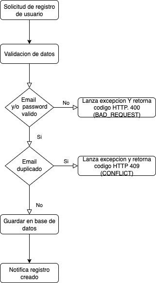

# User Management API
This API has been built to manage the users with the following specifications:



### Tools
- Java 17
- Spring boot 3.5.5
- H2 DB
- Spring doc OpenAPI (Swagger)
- Jacoco code coverage

### Setup
Create an application.properties and add the following information:
```properties
spring.application.name=manage-user
spring.datasource.url=jdbc:h2:mem:usersdb;NON_KEYWORDS=user
spring.datasource.driverClassName=org.h2.Driver
spring.datasource.username=test
spring.datasource.password=test
spring.jpa.show-sql=true
spring.h2.console.enabled=true
spring.jpa.database-platform=org.hibernate.dialect.H2Dialect

app.openapi.dev-url=http://localhost:8080
app.openapi.prod-url=https://manage-user.com

user.validation.password.regex=^(?=.*[A-Z])(?=.*[0-9])(?=.*[@$!%*?&])[A-Za-z0-9@$!%*?&]{8,}$
user.validation.email.regex=^[a-zA-Z0-9._%+-]+@[a-zA-Z0-9.-]+\.[a-zA-Z]{2,}$
```

### Installation

To install the application dependencies run the following maven command:

```sh
mvn clean install
```

To collect the code coverage run the following Maven command:

```sh
mvn clean verify
```

### Documentation
The documentation is available in the following URL
```
http://localhost:8080/swagger-ui/index.html
```

### Database
The database is available in the following URL
```
http://localhost:8080/h2-console
```
### Endpoint 
The endpoints are available in the Postman collection attached in:
```
/resources/data/User management API.postman_collection.json
```
